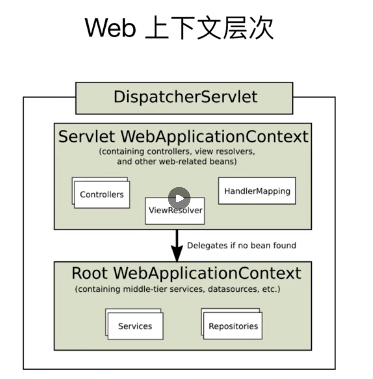

# Spring MVC RESTFull请求处理

核心元素:
- ApplicationContext
- DispatchServlet
- XXXResolver，解析器，比如视图解析，异常解析，页面解析，参数解析等
- HandlerMapping, 请求映射

## DispatchServlet请求核心处理流程

通过DispatcherServlet.initStrategies对DispatchServlet进行初始化

```plantuml
participant REQ as "Request"
participant DS as "DispatcherServlet"
participant HEC as "HandlerExecutionChain"
participant HA as "HandlerAdapter"
participant HM as "ServletInvocableHandlerMethod"
participant IHM as "InvocableHandlerMethod"
participant AR as "HandlerMethodArgumentResolver"
participant RVH as "HandlerMethodReturnValueHandler"
participant ER as "HandlerExceptionResolver"

REQ --> REQ: new
DS --> DS: doService
activate DS
DS --> REQ: setAttribute
note right
填充相关的属性到请求中，比如：
- WebApplicationContext
endnote
DS --> DS: doDispatch
activate DS
DS --> HEC: handler = getHandler
DS --> HA: adapter = getHandlerAdapter(handler)
DS --> HEC: applyPreHandle
DS --> HA: modelView = handle(request, response, handler)
HA --> HM: invokeAndHandle
activate HM
group Core Process
HM --> IHM: returnValue = invokeForRequest
activate HM
IHM --> IHM: args = getMethodArgumentValues
activate IHM
IHM --> AR: args[i] = resolveArgument
deactivate IHM
IHM --> IHM: returnValue = doInvoke(args, ...)
IHM --> HM
deactivate HM
HM --> RVH: handleReturnValue(returnValue, ...)
end
HM --> DS
deactivate HM
DS --> HEC: applyPostHandle
DS --> DS: processDispatchResult(modelView, ...)
activate DS
DS --> ER: modelAndView = resolveException(ex, ...)
DS --> DS: render(modelAndView, request, response)
deactivate DS
note left
对ModelAndView进行渲染或者Exception进行处理
endnote
DS --> HEC: triggerAfterCompletion
deactivate DS
deactivate DS
```

- 绑定Attributes
- Handler的获取和对请求的处理
- Interceptor对Handler对拦截
- Handler返回值处理
- 异常处理

## Handler的获取

通过RequestMapping注解来定义RequestMappingInfo，用于HandlerMapping的映射，
通过DispatcherServlet.initHandlerMappings查找所有HandlerMapping

每个HandlerMapping通过InitializingBean.afterPropertiesSet来进行初始化，加载所有Handler;
通过RequestMappingHandlerMapping.isHandler来查找相关的Handler类，
提取其中的请求处理的方法，通过AbstractHandlerMethodMapping.registerHandlerMethod保存起来，
用于后续的匹配

```plantuml
interface RequestCondition
class RequestMappingInfo {
  public RequestMappingInfo getMatchingCondition(HttpServletRequest request)
  public int compareTo(RequestMappingInfo other, HttpServletRequest request)
}
RequestMappingInfo "1" *--> "*" RequestCondition

interface HandlerMapping {
  HandlerExecutionChain getHandler(HttpServletRequest request);

abstract class AbstractHandlerMapping implements HandlerMapping {
  protected abstract Object getHandlerInternal(HttpServletRequest request);
}
abstract class AbstractHandlerMethodMapping<T> extends AbstractHandlerMapping {
  protected abstract T getMatchingMapping(T mapping, HttpServletRequest request);
}
AbstractHandlerMethodMapping .right.> RequestMappingInfo: use

class RequestMappingHandlerMapping extends AbstractHandlerMethodMapping implements MatchableHandlerMapping 

```

```plantuml
participant DS as "DispatcherServlet"
participant HM as "HandlerMapping"
participant AHM as "AbstractHandlerMapping"
participant AHMM as "AbstractHandlerMethodMapping"
participant RMHM as "RequestMappingHandlerMapping"
participant RMI as "RequestMappingInfo"
participant HEC as "HandlerExecutionChain"

DS --> DS: getHandler
activate DS
DS --> AHM: HandlerExecutionChain handler = getHandler
activate AHM
AHM --> AHMM: HandlerMethod hm = getHandlerInternal
activate AHMM
AHMM --> AHMM: lookupHandlerMethod
activate AHMM
AHMM --> AHMM: addMatchingMappings
activate AHMM
AHMM --> RMI: getMatchingCondition
deactivate AHMM
AHMM --> AHMM: SortAndGetBestMatch
deactivate AHMM
AHMM --> AHM
deactivate AHMM
AHM --> AHM: HandlerExecutionChain chain = getHandlerExecutionChain(hm, ...)
activate AHM
AHM --> HEC: addInterceptor
deactivate AHM
AHM --> DS
deactivate DS
deactivate DS
```

获取Handler之后，通过HandlerExecutionChain添加Interceptors来包装handler，
还可以加入CORS Interceptor。

RequestMapping注解中定义各种匹配条件,
请求匹配优先级，见RequestMappingInfo.compareTo：
1. 路径匹配
2. QueryString
3. Header
4. Content-Type
5. Accept
6. 请求Method

## 对请求的处理

通过HandlerAdapter对handler进行包装

RequestMappingHandlerAdapter.invokeHandlerMethod
-> ServletInvocableHandlerMethod.invokeAndHandle
-> InvocableHandlerMethod.getMethodArgumentValues

主要做以下的事情：
- XXXArgumentResolver 对输入参数进行解析
- 调用handler对请求进行处理
- XXXReturnValueHandler，对返回进行处理

```plantuml

package Input {
interface HandlerMethodArgumentResolver
abstract class AbstractMessageConverterMethodArgumentResolver implements HandlerMethodArgumentResolver

abstract class AbstractNamedValueMethodArgumentResolver implements HandlerMethodArgumentResolver
class RequestHeaderMethodArgumentResolver extends AbstractNamedValueMethodArgumentResolver
class RequestParamMethodArgumentResolver extends AbstractNamedValueMethodArgumentResolver
class PathVariableMethodArgumentResolver extends AbstractNamedValueMethodArgumentResolver
}

package Output {
interface HandlerMethodReturnValueHandler
abstract class AbstractMessageConverterMethodProcessor extends AbstractMessageConverterMethodArgumentResolver implements HandlerMethodReturnValueHandler
class RequestResponseBodyMethodProcessor extends AbstractMessageConverterMethodProcessor
}

package Converters {
interface GenericConverter {
  Object convert(@Nullable Object source, TypeDescriptor sourceType, TypeDescriptor targetType);
}
interface Converter<S, T> {
  T convert(S source);
}
interface Printer<T> {
  String print(T object, Locale locale);
}
interface Parser<T> {
  T parse(String text, Locale locale) throws ParseException;
}

interface Formatter<T> extends Printer, Parser
}
AbstractNamedValueMethodArgumentResolver ..> Converters: databinder will use converters

interface HttpMessageConverter
class HttpMessageConverters
HttpMessageConverters "1" *--> "*" HttpMessageConverter
RequestResponseBodyMethodProcessor "1" *--> "*" HttpMessageConverter

```

- HandlerMethodArgumentResolver, 处理入参转换
- HandlerMethodReturnValueHandler，处理返回值
  - RequestResponseBodyMethodProcessor, 针对RequestBody入参和ResponseBody返回值的处理
- HttpMessageConverters, 用于配置HttpMessageConverter
- HttpMessageConverter
  - MappingJackson2HttpMessageConverter, 用于json序列化处理
    - JsonComponent/JsonSerializer/JsonDeserializer, 自定义类型转换


- WebMvcAutoConfigurationAdapter.addFormatters配置类型转换器
   
### Interceptor拦截器

## 异常处理

- HandlerExceptionResolver
- @ExceptionHandler

```plantuml
interface HandlerExceptionResolver

```

## 配置

Spring MVC需要定义一些基础的Bean，
默认配置定义在[DispatcherServlet.properties](https://github.com/spring-projects/spring-framework/blob/main/spring-webmvc/src/main/resources/org/springframework/web/servlet/DispatcherServlet.properties)

- WebApplicationInitializer
  + AbstractDispatcherServletInitializer，
  用于对DispatcherServlet进行配置, 包括Filter的处理链

## ApplicationContext



默认AOP只对它所在ApplicationContext中的Bean进行增强；
如果要在所有ApplicationContext进行增强，
则需要在每个ApplicationContext中开启AOP增强，
并将Aspect定义在Root的ApplicationContext中

- XXXDispatchServletInitializer
- WebMvcConfigurer


## Handler的获取和对请求的处理

### Handler获取

- HandlerMapping, 寻找最佳匹配的请求处理器
- HandlerExecutionChain

### 请求处理

- HandlerAdapter
- 参数解析
- HandlerExceptionResolver

### 定义请求映射

- Controller
- RequestMapping
- RequestBody, 使用HttpMessageConverter来转换

### 自定义类型转换

Spring Boot通过WebMvcAutoConfiguration进行自动装配，
通过addFormatters添加Converter，Formatter，GenericConvert相关的类

### 校验

- Validator
- @Valid
- BindingResult, 保存解析校验的结果

### 视图处理

- ViewResolver
- ModelAndView解析
- ResponseBody解析
    + RequestResponseBodyMethodProcessor
    
### 异常处理

- HandlerExceptionResolver

## Reference

- [Spring MVC](https://docs.spring.io/spring-framework/docs/current/reference/html/web.html#spring-web)